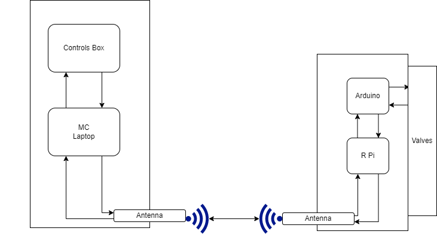
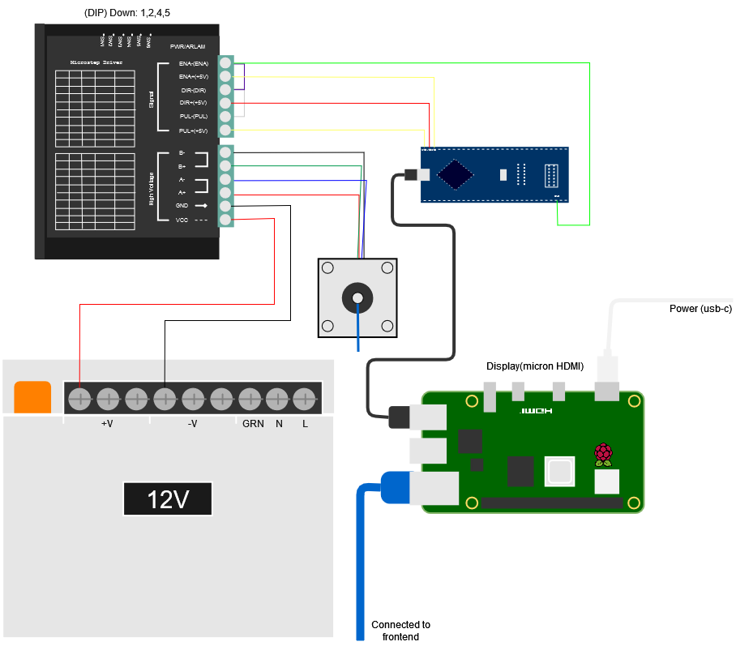

# Hybrid-Controls-System (HB - Project Acronym)

UVic Rocketry's hybrid controls system is designed to actuate and monitor the states of stepper motor driven valves located on a high-pressure oxidizer feed system. The controls system includes the following components:
- Controls Box : A physical panel with toggle switches, momentary buttons, indicator lights, and a buzzer
  - Sends commands to MC Computer based on user input through switches/buttons
  - turns on indicator light once valve state has been confirmed
- MC Computer : The "server" in the client-server communication model
  - Sends commands to R Pi based on controls box input 
  - Recieves valve state confirmation from R Pi
  - Sends valve state confirmation to Controls Box
- Raspberry Pi : The "client" in the client-server communication model
  - Recieves command from MC Computer
  - Relays command to Arduino
  - Recieves confirmation of valve state from arduino
  - Relays confirmation back to MC computer
- Arduino : Actuates all valves on the test stand
  - Recieves command from R Pi
  - Executes valve movements
  - Obtains confirmation or error from limit switches
  - sends confirmed valve states or error back to the R Pi

## Control Box Arduino
The Lockout Box Arduino is used for including physical switches, buttons, and safety measures that integrate with the virtual controls offered by the GUI software. The Arduino will be connected via USB to the Controls laptop and have the serial input interpreted by the GUI software. 

### Objectives
- maximize visibility
- maximize safety
### Constraints
- e-stop press sends system to safe state
- physical control for arming system
- visual indicator for system armed
- visual and auditory indicator for system in auto mode
- max operating voltage is 12V
- max available GPIO dictated by Arduino

## Mission Control Laptop & Raspberry Pi

The communication between Mission control and the Test Stand is facilitated by a python-written server-client model. The client and server send commands to each other in order to control the test stand. The commands take the form of a parameter and a state separated by a space. For example, to close the MEV, the server would send the following message: “MEV closed”. The client would receive that command and update the arduino accordingly. After receiving confirmation that the MEV had been closed successfully, the client would send a confirmation message back to the server which would take the same form as the original command e.g. “MEV closed”

### Implementation (How to Establish Connection)

The hybrid_test_backend.py file imports a Server object from the server.py file. Make sure that both of those files are present in the same folder when running the software

The controller.py file imports a Client object from the client.py file. Make sure that both of those files are present in the same folder when running the software.

At the top of the controller.py file are two values HOST and PORT. 
The HOST value is the IP of the computer that is running the server (hybrid_test_backend.py)

To determine the correct IP:
1. On the computer that is running hybrid_test_backend.py open command prompt
2. Type in ipconfig and hit enter
3. Find line labelled IPv4 Address. That is the correct IP address

You should make sure that the HOST value in controller.py matches the value of the IPv4 address before you attempt to run the software

There is a PORT value in both hybrid_test_backend.py and in controller.py, make sure they are the same before attempting to run the software

### Common Issues
If you are having trouble getting the connection to establish:
Double check that the IPv4 address matches HOST
Double check that the two PORT values match

Your computer’s firewall will likely block the connection initially. If your connection is failing and none of the above fixes work try the following steps.

1. Disable the firewall on both devices (the raspberry pi likely doesn’t have a firewall so don’t worry about that) 
2. Attempt the connection again
3. If it works this time and you don’t want to permanently leave your firewall off follow the steps in the following tutorial to open your firewall to that port https://www.tomshardware.com/news/how-to-open-firewall-ports-in-windows-10,36451.html

## Valve Control Arduino

The Arduino in charge of valve control accepts commands from the R Pi over serial. The arduino is then in charge of rotating the stepper motors until limit switches are contacted, allowing the Arduino to send back a confirmation of the valve state. 

### Objectives
- provide mission control with accurate valve states as often as necessary
### Constraints
- execute commands given by R Pi
- confirm valve state 
- must initialize valves to safe state (ie. allows for short power loss or e-stop reset to put system into safe state)
- must identify stuck valves and relay to Mission Control (can use timer)

### Wiring

  
_Note: If you get the draw.io extension for vs code you can edit this picture directly._

## Testing System Integration

To start testing the system, ensure all motors and limit switches are wired correctly following the diagra in the *Valve Control Arduino* section.    

  Next plugin the computer running the GUI to the Rpi 4 using a ethernet cable. You can now start up the server and connect to the client. To do this you have to run controller.py on the raspberry pi and hybrid_test_backend.py on the GUI computer. Once both of those are running you can follow the connection steps in implementation.

  To test, make sure the arduino folder is uploaded to the arduino and the QueueList is working imported properly. To connect to the arduino you need to change `serial_port` in controller.py to the correct port on the raspberry Pi.
